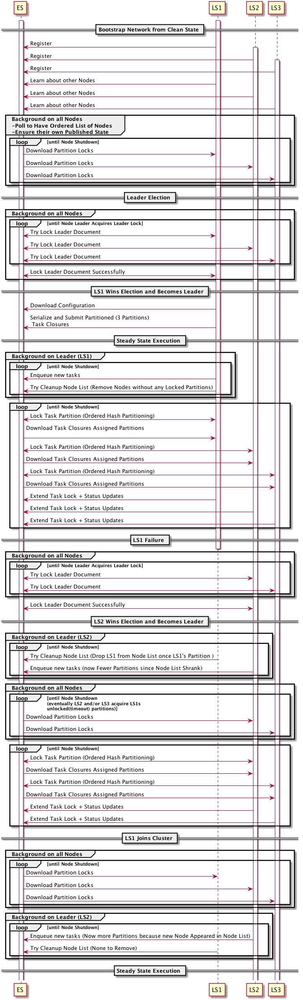

# Introduction - Execution Flow Overview

See below Diagram for a design that involves no P2P communication, with only LS to ES over the
wire communication.  



* Locks in ES via Versioned Updates
* Leader Election via ES Lock
* Nodes advertise themselves by updating Node List in ES
* Leader partitions according to Node List
* Leader attempts to clean up Node List
   * Correctness not required
* Followers assign unassigned tasks/partitions actively by locking the respective lock document for
each partition

### Background Loop on each Node

* Ensure own Advertisement in Node List
* Poll all partition lock docs to acquire tasks when spare workers are available
  * Try locking partitions in a non-random way (use position in Node List and Node count to determine what available partition to try and lock first)
  if multiple partitions can be acquired
  * Acquire partitions with some random timeout between acquisitions to make even task distribution
  more likely

### Main Loop on each Node

* Run Tasks that the background loop acquired

### Main Loop on Leader

* Try cleanup Node List conservatively by removing Nodes that timed out on their Partition Lock(s)
* Create new Partition Lock Documents holding serialized Tasks
* Remove completed Partition Lock Documents whose Tasks were successfully completed

# 3 Things Need Implementation

## Task Partitioning

This is heavily dependant on plugin implementation wise. Logically we could identify three logical
categories of plugins:

1. Can’t be partitioned (TCP Input, UDP input, HTTP input I would exclude file input from this 
category since we could still document and implement this based on NFS trivially
2. Doesn’t require partitioning (just supervision) in some configurations
   * Examples:
      * Kafka
      * RabbitMQ
      * HTTP Poller
   * Leader assigns partitions to followers after partitioning once (repartition only on node topology changes)
   * Followers report state back to leader (implicit heartbeat)
   * Leader stops execution, repartitions and restarts execution on node join/leave
3. Requires partitioning and windowing (at least in some configurations)
   * Examples:
      * Kafka (manual partition assignment), HTTP Poller (set specific metadata)
      * S3
      * (NFS)
   * Leader continuously assigns tasks to followers
   * Followers leaving trigger reassignment of their task after a timeout
   * Followers joining assign themselves new tasks as they become available as a result of more nodes in the cluster
  
## Task Serialization

* Serializing simple config like data structures only won’t work when we need windowing and will
require implementing APIs for reporting state back to the master.
* Serialize Lambdas for the inputs instead and have plugins deal with coordination
Provide serializable distributed Semaphore/Lock and StatusReporter
* Allow running lambdas on Slaves via slave.execute(inputLambda) => ExecutionFuture<Input>
(with handlers for failures, done and the ability to cancel) with master node maintaining a list of
slaves (very ergonomic, because code can essentially be written like multi-threaded code, you only
need to work with serializable variables only in the lambdas which as proven by Spark isn’t a
practical issue if you provide serializable concurrency primitives)
   * Needs a static way to get a hold of the Queue inside the Lambdas (trivial)

### Example Code Executed on Leader

#### S3
```java
while(true) {
    slaves  = getIdleSlaves(); // Blocks until slave becomes available 
    slaveCount = slaves.length;
    files = getOutstandingS3Files(slaveCount) // block & ret. max. #slaveCount files
    i = 0;
    context = getContext(); // holds short-lived state and is serializable
    for (file : files) {
        slaves[i++].submit(
                ()  -> {downloadFileToLsQueue(context, file)); commitToEs(file);} // Runs on Slave
            ).onFailureOrTimeout(
                () ->{
                    slaves[i % slavecount].markDead(); // Runs on Master and persists information in ES
                    reEnqueue(file); // same here, master persists the state to ES
           }
     );
    }
}
```


#### Kafka

```java
while(true) {
	context = getContext(); // holds short-lived state and is serializable
	for (slave : getIdleSlaves()) { // Runs on Master
	    slaves[i++].submit(
	    () -> runKafkaInput(context).onFailureOrTimeout() // Runs on Slave
	    () -> slaves[i % slavecount].markDead()
     );
  }
}

```

## Distributed State

* Advertise peers in ES to allow for bootstrapping if all LS nodes go down
* Store configuration in ES to bootstrap cluster
* Locking via ES
* All shared data structures use versioned updates to ensured atomic operation 


### Extremal Single Node Case

* Either for non-parallelizable inputs or if no clustering is configured
* Use on-disk flat-file as state store instead of ES
   * Can use FS locking to ensure exclusivity here and put the same API in front of ES version handling
* Run leader and slave inside the same JVM

### How to Implement ES Lock

* Lock document stores random token generated by node
* Lock document stores expire timestamp
* Node updates expire timestamp and sets its own random token (use something safe like UUID)
in lock document when acquiring lock
   * i.e. when lock doc does not exist or current time is past expire timestamp
* Can be implemented in a correctly locked way by using versions or scripted updates
* Unlocking by setting expire time to `0`
* Lock holder has to periodically renew hold on lock by updating expire timestamp before it loses
hold on lock
* Lock holder must not perform any operation requiring holding the lock once the expire time it
inserted into the lock document has arrived
  * This requires some care when implementing potentially slow lock-holder operations
  (using an appropriate timeout on lock-holder indexing should be fine as a solution here)

#### Lock Document

```json
{
   "holder" : "2c717297-6375-4c14-afd2-3d246fdc5d54",
   "expire" : 1515527529288
}
```

* Polling can happen at a relatively low rate on all nodes since it never makes sense to poll
before `expire`

#### Node List Document

* Can be safely updated by versioned updates
* Identify nodes by their tokens and worker count (need the count for more precise partitioning),
no need to know anything else about other nodes

```json
{
 "nodes" : [
 {
 "token" : "2c717297-6375-4c14-afd2-3d246fdc5d54",
 "workers" : 5
 }, 
 {
 "token": "07121045-3df3-4755-be40-9a90e47bda6f",
 "workers" : 3
 }
 ]
}
```

#### Partition Lock Document

* Like Leader Lock
* Holds base64 encoded serialized task to be worked on once holding the Lock
* Can have states "outstanding" (if holder is non-empty it implies "in progress"), "done"

```json
{
   "holder" : "2c717297-6375-4c14-afd2-3d246fdc5d54",
   "expire" : 1515527529288,
   "task": "ZnNkZnNkZnNkZ2JuamJkbmZpb2dkc2Zpb2dub2RpZm5vaW5pMjQyMTM0bjMyaTQzLy9kc2Y=",
   "state": "outstanding" 
}
```

* Getting all partition's `expire` field in a single request should be possible for any kind
of plugin
